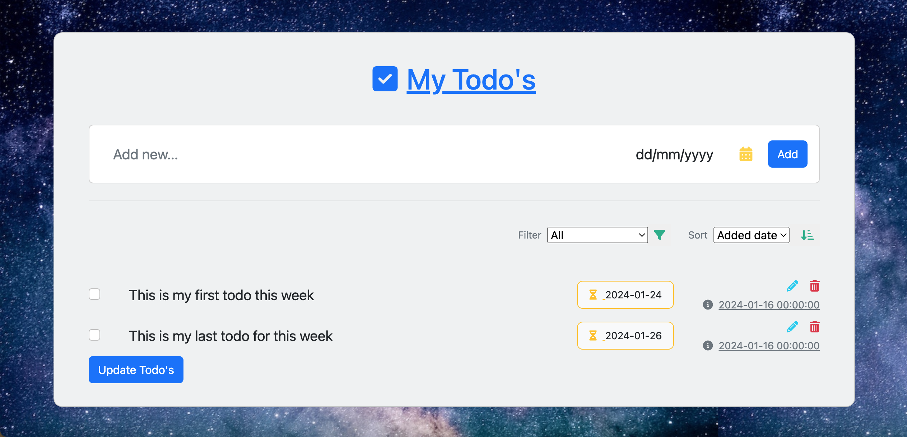

# Todo's Wesbite App

## 
### Description
This is an online website to save, sort and filter your todos according to its created date or due date. 

### Project motivation
I completed this To_Dos website, as one of the assignments in professional [Python 100 Days bootcamp](https://www.udemy.com/course/100-days-of-code/) by [Dr. Angela Yu](https://github.com/angelabauer).
I started by utilizing the Bootstrap CSS template provided by [MDB](https://github.com/mdbootstrap/bootstrap-to-do-list) MDBootstrap. Then I completed the back-end of the app using Flask and Sqlalchemy.

### Quick Start
- Install the requirements in requirements.txt
- Run the app in Python 
